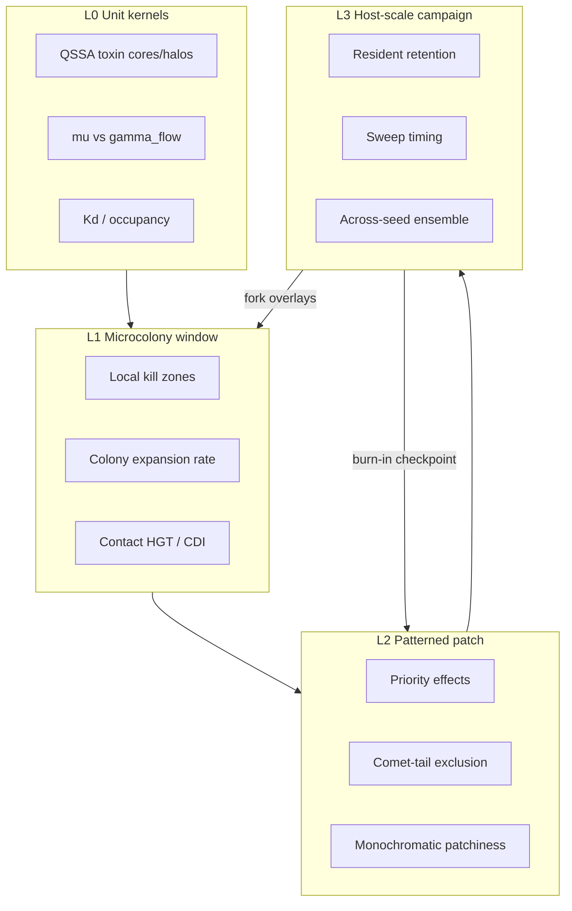

# Multi-Scale Experimental Ladder for GutIBM

Canonical methodology for assigning scientific questions to short/small vs
long/large runs, and for composing nested experiments so microstructure sets up
a consistent macrostructure without full-factorial megasims.

Related:

- Campaign configs: [`experiments/diversity_campaign/README.md`](../experiments/diversity_campaign/README.md)
- Burn-in → fork on AWS: [`docs/AWS_BATCH.md`](AWS_BATCH.md)
- Batch sweeps: [`docs/BATCH_RUNNER.md`](BATCH_RUNNER.md)
- Frameworks: [`EARI.md`](../EARI.md), [`VADI.md`](../VADI.md)

---

## 1. Paradox and goal

Empirical tension for *Enterobacteriaceae* in the colonic mucus:

| Observation | Implication for modeling |
|-------------|--------------------------|
| Within-host diversity is typically low; sweeps are fast | Host-scale retention / sweep timing needs days, not minutes |
| Across-host diversity is modest (not zero) | Compare an **ensemble of hosts**, not a larger spatial box |
| Locally, cells are sparse microcolonies that grow quickly | Antagonism and growth kinetics are resolvable in small windows |
| Bacteriocins are effective antagonism | Lethal cores/halos and comet tails must be tuned locally first |
| Colonization patterns persist | History matters — microstructure must set up macrostructure |

Running huge numbers of full 2 mm × 7-day campaigns is a poor primary tuning
loop. The goal of this ladder is to **learn each class of question at the
cheapest scale that can support it**, then promote calibrated parameters upward
and reuse established colonization states via burn-in → fork.

---

## 2. Two kinds of multi-scale

GutIBM already separates scales in two different ways. Do not confuse them.

### A. Physics timescale separation (inside one run)

Toxins and siderophores diffuse much faster than cells divide. The hybrid
architecture leapfrogs chemistry vs biology:

- **QSSA Green’s functions** for bacteriocins (instantaneous relative to `bio_dt`)
- **L-stable implicit diffusion** for nutrients / small molecules at `bio_dt` (default 60 s)
- **VBF** for the anaerobic background (continuum, not discrete agents)

See [`docs/MECHANISMS.md`](MECHANISMS.md) and EARI/VADI. This is *solver*
multi-scale; it does not by itself tell you which experiments to run.

### B. Experimental ladder (across runs)

Workflow nesting: short/small runs calibrate kernels and local kinetics; burn-ins
freeze patterned populations; forks explore dynamics from those states; sparse
host-scale campaigns answer retention and sweep questions. Nesting here means
**compose experiments**, not couple nested PDE domains in one process.



---

## 3. Question → level assignment

| Level | Spatial / temporal | Scientific target | Must *not* claim |
|-------|-------------------|-------------------|------------------|
| **L0** unit / CI | Tiny domain or pure unit tests; minutes–hours | Kernel fidelity: toxin shape, washout inequality \(\mu < \gamma_{\mathrm{flow}}\), receptor Kd sensitivity, Fix wiring | Host diversity, sweep statistics |
| **L1** microcolony window | ~50–500 µm, 0.25–2 h, ~20–150 agents | Local antagonism efficacy, colony doubling, CDI/contact kill, motility/taxis stability | Cross-patch coexistence, retention over days |
| **L2** patterned patch | ~0.5–1 mm (or same domain as burn-in), 1–24 h, **started from established state** | Whether a resident halo/comet maintains exclusion; immigrant washout under flow; Hopkins / monochromatic / exclusion radius | Full host retention curves; mutation-driven BI expansion |
| **L3** host campaign | 2 mm, 2–7 d, sparse ensembles | Retention ~70–80%, sweep timing, modest across-seed diversity; Kd / mechanism ablations | Fine-grid parameter tuning (do that at L0–L2) |

**Cross-host diversity** = ensemble of L3 runs (different seeds, burn-ins, or
immigrant-arrival overlays), not a larger spatial domain.

### Question cheat sheet

| Scientific question | Level | Primary configs / tests | Primary observables |
|---------------------|-------|-------------------------|---------------------|
| Are Lethal Core vs Halo / comet-tail kernels correct? | L0 | `greens_function`, `fmm`, `examples/eari_vadi_validation/` | Radial/comet profiles; golden FISH/spatial metrics |
| Does \(\mu_{\mathrm{realized}} < \gamma_{\mathrm{flow}}\) wash out stressed cells? | L0 | `washout_trap`, iron-fallback / receptor unit tests | Live counts; fingerprint divergence |
| Does a microcolony grow / kill locally as expected under Kd / toxin / CDI? | L1 | Stage 1–2; `examples/cell_biology/`; `examples/single_colony/` (shortened) | `events/*` kills/divisions; mean µ; local NND |
| Does motility/taxis stabilize colonization on short horizon? | L1 | Stage 1 (`1a`–`1f`) | Population viability; z-bias |
| Do O₂ / acetate / crypts / CDI wire without NaNs and with expected direction? | L1 | Stage 2 (`2a`–`2f`) | Mechanism-specific summary scalars |
| Does an established resident pattern exclude immigrants over hours? | L2 | Short fork from burn-in (`checkpoint_file` / `gut-ibm-aws-branch`) | `monochromatic_score`, Hopkins, exclusion radius, immigrant washout events |
| What is resident retention and sweep timing over days? | L3 | Stage 3 / `examples/diversity_paradox/` | `resident_retention`, lineage composition vs time |
| How much diversity differs across hosts? | L3 ensemble | Multiple burn-in seeds + forks; keep scratch controls | Across-seed spread of retention / patchiness |

---

## 4. Composition protocol: establish → nest → fork → occasional full

### Step 1 — Establish (few expensive runs)

Freeze colonization geometry, chemistry fields, and genomes with a small number
of burn-ins:

- Config: [`experiments/diversity_campaign/stage3_campaign/3a_burnin.json`](../experiments/diversity_campaign/stage3_campaign/3a_burnin.json) (~2 simulated days)
- Batch: `batch_burnin.json` when seeding multiple colonization histories
- Closed restarts: `restart.enabled`, `restart.directory`, `restart.interval_steps` (Stage 3 cadence often `60` ≈ 1 h at `bio_dt=60`)
- Artifacts: immutable `restart/step_*.h5` + `latest.json` (local or S3; see [`AWS_BATCH.md`](AWS_BATCH.md))

Tier-2 closed restarts restore agents (positions, genomes, µ / µ_max, crypt flags)
and the full chemical grid. RNG is **reseeded** from the job `seed` on resume —
forks are population-state branches, not bit-identical continuations.

### Step 2 — Fork (cheap science)

Branch many short overlays from the same burn-in:

```bash
# Local: point a short overlay at a closed restart
# (set checkpoint_file / checkpoint_step in the overlay JSON)

# AWS:
gut-ibm-aws-branch \
  --from "s3://${OUTPUT_BUCKET}/campaign/burnin_seed1001/ckpt/latest.json" \
  --overlay experiments/diversity_campaign/stage3_campaign/3_kd_sweep_1e-7.json \
  --seed 2001 --total-time 86400 \
  --out-prefix "s3://${OUTPUT_BUCKET}/campaign/fork_kd1e-7_seed2001" \
  --job-queue gutibm-gpu-campaign \
  --job-definition gutibm-cuda-campaign
```

Typical fork overlays: bacteriocin Kd, motility on/off, immigrant pulse,
toxin enable/disable, receptor affinities. Prefer cutting `total_time` for L2
questions; reserve full 7-day `total_time` for L3 retention.

Use [`gut_ibm_tools.batch_runner`](BATCH_RUNNER.md) / Stage 3 `batch_*.json`
for Cartesian sweeps once the overlay set is stable.

### Step 3 — Nest (L1/L2 inside L3 patterns)

Checkpoint **crop to a spatial sub-window is not supported** today (grid cell
count must match; domain comes from the new config). Nesting rules:

| Goal | How |
|------|-----|
| Continuity of the toxin-scape / patterned population matters | **Same-domain short fork**: keep `domain_*` and `grid_dx`, cut `total_time` |
| Question is local kinetics only | **Independent small window**: Stage 1–2, `examples/cell_biology/`, or shrink `domain_*` + coarsen `grid_dx`; transfer **calibrated parameters** upward, not agent coordinates |
| Gate expensive campaigns | Promote mechanism flags to L3 only after L1/L2 decision gates pass (see §5) |

### Step 4 — Consistency checks (micro → macro contract)

Before trusting an L3 campaign under a tuned parameter set:

1. **L0** — unit suite and `eari_vadi_validation` goldens still pass
2. **L1** — microcolony kill / growth rates move in the expected direction when Kd / toxin / motility change
3. **L2 fork** — `monochromatic_score` / exclusion radius / immigrant washout respond directionally from the burn-in state
4. **L3** — keep a few **full-from-scratch** seeds as burn-in bias controls (shared colonization history can correlate forks)

### Step 5 — Rare full ladders

Re-run burn-in only when a change alters the **colonization process itself**:

- Motility ON/OFF that changes early settlement
- Crypt enablement / geometry
- Nutrient architecture (O₂, acetate, mucin) that reshapes early niches

If the change is a midstream interaction strength (e.g. Kd sweep on an already
colonized landscape), **reuse** the established burn-in and fork.

---

## 5. Decision gates

These extend the Stage 1–2 gates in the diversity campaign README.

### After L0

- Kernel / washout / parser / wiring tests green under the candidate params
- `examples/eari_vadi_validation/` golden + FISH regression still within thresholds

### After L1 (Stage 1–2)

- **Motility:** if `1d` (aerotaxis + energy) sustains a viable population → consider motility ON for L3 (`3c`); if it collapses → keep motility OFF and investigate before promoting
- **Mechanisms:** if `2e` is stable (no NaNs, bounded population) → proceed with full mechanisms; if any ablation crashes → fix before L3
- **Local antagonism:** Kd / toxin toggles change kill events and local exclusion in the expected direction on Stage 2 / cell_biology windows

### After L2 (short forks from burn-in)

Accept a fork ensemble for promotion to L3 only if:

- Immigrant washout / exclusion metrics move with bacteriocin potency (Kd sweep directionality)
- Spatial signatures (`hopkins_statistic`, `monochromatic_score`, exclusion radius) remain biologically plausible (no total mixing collapse unless that is the hypothesis under test)
- At least one scratch-control seed (no shared burn-in) still shows the same qualitative direction

### After L3

- Analyze retention and sweep timing; compare motile vs non-motile if Stage 1 passed
- Report across-seed (across-host) spread separately from within-run patchiness
- Do not retune fine Kd grids here — drop back to L1/L2 forks

---

## 6. Map onto existing tooling

| Need | Existing mechanism |
|------|-------------------|
| Short / small | Stage 1–2; `examples/eari_vadi_validation/`; `examples/cell_biology/`; shrink `domain_*` + coarsen `grid_dx` |
| Established patterns | Closed Tier-2 restart; `checkpoint_file` + `checkpoint_step`; burn-in → fork |
| Parameter exploration | `python -m gut_ibm_tools.batch_runner`; Stage 3 `batch_*.json`; `examples/batch_scan/` |
| Tuning observables | HDF5 `/summary` events + `spatial/{hopkins_statistic, mean_nnd, monochromatic_score}`; Python `gut_ibm_tools.validation` / FISH; C++ `sim_fingerprint` for CI |
| Cloud cost control | AWS Spot + immutable checkpoints ([`AWS_BATCH.md`](AWS_BATCH.md)) |
| Orchestration | `./rebuild_and_run.sh` stage/batch modes |

Representative scales already in-repo:

| Config family | Domain | Horizon | Role |
|---------------|--------|---------|------|
| Unit / `washout_trap` | ≪ 100 µm (tests) | short | L0 |
| `examples/cell_biology/` | 50 µm × 50 µm × 25 µm | 1 h | L1 |
| Stage 1–2 | 500 µm × 500 µm × 100 µm | 1 h | L1 |
| `examples/eari_vadi_validation/` | 500 µm, `grid_dx=5` µm | 900 s | L0/L1 CI goldens |
| `examples/single_colony/` | 1 mm × 1 mm × 100 µm | 1 d | L2-ish / demo |
| `3a_burnin` | 2 mm × 2 mm × 100 µm | 2 d | Establish |
| Stage 3 / `diversity_paradox` | 2 mm × 2 mm × 100 µm | 7 d | L3 |

---

## 7. What not to do

- **Full-factorial L3** for every Kd × motility × seed × mechanism — use burn-in forks and L1/L2 gates
- **Tune fine Kd grids only on 7-day runs** — directionality belongs at L1/L2; L3 confirms retention
- **Claim within-host diversity or sweep statistics from 1 h windows** — wrong level
- **Treat cross-host diversity as a bigger domain** — use an ensemble of L3 / burn-ins
- **Crop a large checkpoint to a small window** — unsupported; grid size must match
- **Expect bit-identical resumes after fork** — RNG is reseeded; compare distributions, not fingerprints across forks
- **Invent a parallel campaign structure** — reuse Stage 1–3 folders and AWS burn-in recipes

---

## 8. Current limitations and future tooling backlog

Documented so methodology users do not assume unimplemented features. None of
these block the ladder above.

| Gap | Impact | Status |
|-----|--------|--------|
| No spatial sub-window crop / resample from checkpoint | Cannot literally nest a 100 µm box inside a 2 mm restart | Use same-domain short forks or independent small windows |
| No JSON microcolony template ICs | Patterned starts require checkpoint resume or C++ test seeding | Parameter transfer from L1 is the intended path |
| No coupled nested multi-resolution PDE | Nesting is workflow-only | Intentional for now |
| Tier-3 RNG serialize | Forks not bit-identical | Population-state branching is the science contract |
| Full-grid chemistry per MPI rank | Stage 3 memory-bound; often `mpi_ranks: 1` | Slab-local chemistry is a future infra item |

---

## 9. Minimal recipe (copy-paste)

```text
1. L0:  ctest (unit) + examples/eari_vadi_validation   → kernels OK?
2. L1:  Stage 1 motility gate + Stage 2 mechanism gate → flags for L3?
3. L3 establish: 3a_burnin (few seeds) + closed restarts
4. L2 forks: short overlays (Kd / immigrant / toxin) from latest.json
5. L2 gate: directional spatial + washout metrics; keep scratch controls
6. L3 confirm: sparse 7-day ensembles only for retention / sweeps / across-host
7. If colonization process changed → re-burn-in; else keep forking
```
