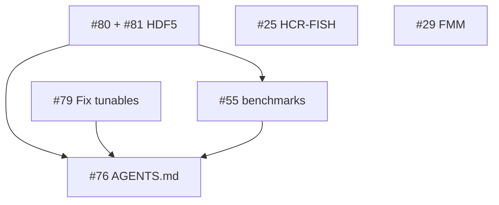

# GutIBM Project Board

Living kanban for open work on [GutModelBacteriocins](https://github.com/bckirkup/GutModelBacteriocins). Mirrors the PR-bundling plan from the Jun 2026 issue queue review.

**Last updated:** 2026-06-24

## One-click setup (local)

With `gh` authenticated and `project` scope:

```bash
./scripts/setup_project_board.sh
```

This creates GitHub labels, milestones, a Projects v2 board, and links open issues. See [scripts/setup_project_board.sh](../scripts/setup_project_board.sh).

**Manual UI:** Repository → **Projects** → **New project** → **Board** → name it `GutIBM Roadmap`, then drag issues from the tables below.

---

## Board columns

| Column | Meaning |
|--------|---------|
| **Done** | Merged to `main`; close the issue |
| **Backlog** | Scoped but not started; no active branch |
| **Ready** | PR bundle defined; pick up next |
| **In Progress** | Branch open / agent or human working |
| **In Review** | PR open, awaiting merge |


---

## Current board state

### Done

| Issue | Title | PR |
|-------|-------|-----|
| #75 | MPI periodic-x deadlock (2 ranks) | #87 |
| #77 | MPI agent tag collisions | #87 |
| #78 | Parser warn on bad numerics | #85 |
| #40–#43 | Washout, MPI transfer, plasmids, multi-rank tests | #62, #71 |
| #44, #52, #59 | HDF5 checkpoint, round-trip, reader | #68–#69 |
| #56 | EARI/VADI CI validation | #73 |
| #33 | GPU acceleration | #83 |
| — | GreensFunction null guard | #84 |
| — | JsonCursor lifetime fix | #86 |

### In Review

_None_

### In Progress

_None_

### Ready (recommended PR bundles)

| Bundle | Issues | Track | Notes |
|--------|--------|-------|-------|
| **HDF5 checkpoint v2** | #80 + #81 | `track:hdf5` | Writer schema + `mpirun -np 2` round-trip; natural single PR |
| **Fix tunables** | #79 | `track:config` | Nested JSON keys; land after #78 (merged) |
| **Docs hygiene** | #76 | `track:docs` | Refresh `AGENTS.md` after above land; docs-only |

### Backlog

| Issue | Title | Track | Depends on |
|-------|-------|-------|------------|
| #55 | Scaling benchmarks 10⁶–10⁷ agents | `track:scale` | Stable MPI + HDF5 (#80–#81) |
| #25 | HCR-FISH / DNA-FISH validation models | `track:science` | Independent (Python) |
| #29 | True higher-order FMM | `track:science` | Independent (diffusion); large |

---

## Merge order (critical path)



1. **#80 + #81** — checkpoint correctness + parallel I/O tests  
2. **#79** — config surface (can parallelize with step 1)  
3. **#55** — benchmarks once core I/O is stable  
4. **#76** — doc sweep last (or tiny edits per PR)  
5. **#25**, **#29** — anytime; separate PRs each  

---

## What not to bundle

| Don't combine | Reason |
|---------------|--------|
| #76 + functional PRs | Reviewers can't separate behavior from docs |
| #29 or #25 + bugfix PRs | Unrelated scope; hard to revert |
| #55 + #29 | Benchmark Barnes-Hut first, not half-finished FMM |

---

## Milestones (for Issues tab filter)

| Milestone | Issues |
|-----------|--------|
| P1 — Docs & hygiene | #76 |
| P2 — HDF5 checkpoint complete | #80, #81 |
| P3 — Config surface expansion | #79 |
| P4 — Scale & profiling | #55 |
| P5 — Research enhancements | #25, #29 |

---

## Custom fields (GitHub Projects v2)

If using Projects v2 table/board view, add:

| Field | Type | Values |
|-------|------|--------|
| **Track** | Single select | hdf5, mpi, config, docs, scale, science |
| **Bundle** | Text | e.g. `hdf5-v2`, `solo` |
| **Priority** | Single select | high, medium, low |

Suggested priorities:

- **high:** #80, #81, #79  
- **medium:** #76, #55  
- **low:** #25, #29  

---

## Closed queue reference (#40–#60)

The Jun 2026 review queue is largely complete. Remaining follow-ups are #76–#81 plus long-horizon #25, #29, #55. See [AGENTS.md](../AGENTS.md) open issue tracker for landmines still documented as open in code comments.

---

## Maintaining this board

After each merged PR:

1. Move issue(s) to **Done** and close on GitHub  
2. Update the **Done** table above (or run setup script in dry-run)  
3. If #76 is the only open hygiene item, keep it in **Ready** until the HDF5/config wave lands  

When opening a new PR, add the issue number to the PR title (`#80`) and set the project item to **In Review**.
